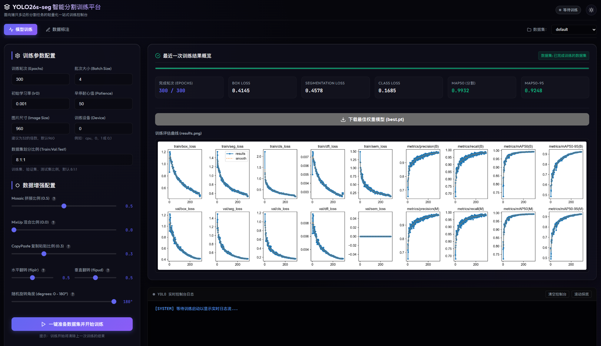
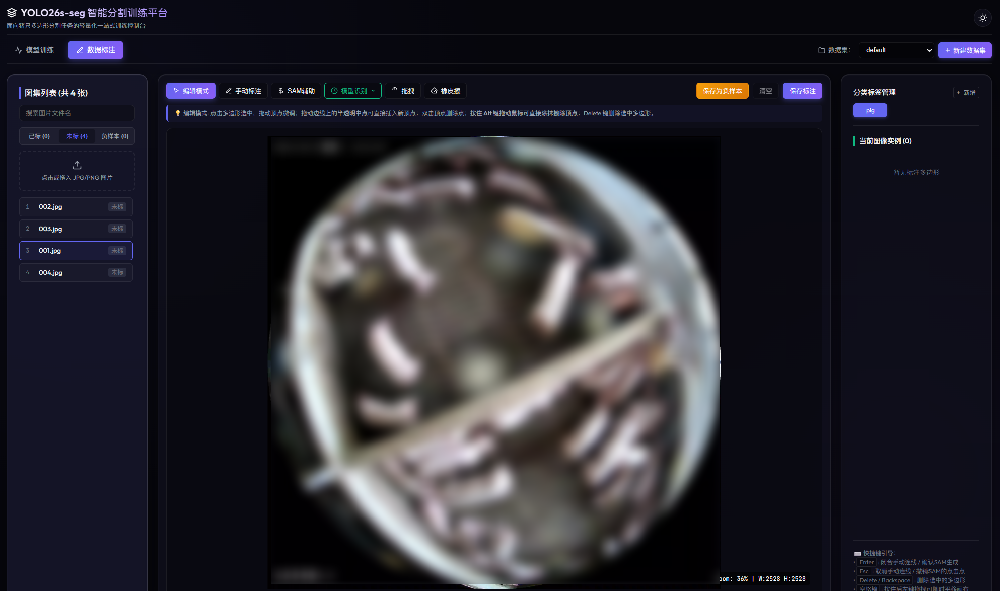

# YOLO26s-seg 智能分割训练平台

这是一个基于 **FastAPI (后端)** 和 **Vue 3 (前端)** 构建的轻量化 YOLO26s-seg 实例分割训练及标注控制台。为分割数据集定制，支持自动化数据集解压、随机划分、YOLO 格式 data.yaml 生成、数据增强调整以及控制台日志实时监控。

> 临时放行 9523，如果系统用了 firewalld：
先查看状态：

```bash
sudo firewall-cmd --state
```

放行端口：

```bash
sudo firewall-cmd --permanent --add-port=9523/tcp
sudo firewall-cmd --reload
```

---

## 📷 界面预览 / Preview

<div align="center">

### 🚀 模型训练与控制台实时监控


<br/>

### ✏️ 交互式多模式数据标注平台


</div>

---

## 🌟 核心功能

1. **一键数据集准备**：自动解压并按照指定比例随机划分 `train` / `val` / `test` 数据集。
2. **负样本智能管理与一键保存**：提供专门的“保存为负样本”按钮，可将图片一键重命名为递增编号 `负样本{N}` 并创建空 `.txt` 文件参与训练。同时优化分类筛选逻辑，支持“已标”、“未标”、“负样本”状态过滤。
3. **训练参数自定义**：配置 epochs、batch size、学习率 (lr0)、早停耐心值 (patience)、输入图片尺寸 (imgsz) 和设备 (device)。
4. **数据增强配置**：直观控制 Mosaic、MixUp、Copy-Paste、旋转及水平/垂直翻转概率。
5. **实时训练监控**：基于 SSE 技术的极客终端，实时流式显示 YOLO 训练控制台输出、当前正在训练的数据集名称及当前 Epoch 进度。
6. **硬件负载监测**：实时刷新服务器的 CPU、内存占用以及 GPU 加速检测状态。
7. **一站式多模式标注**：
   - **手动绘制与首点雷达高亮**：高精度点击打点，第一个关键闭合点具备**显著尺寸放大**与**动态扩散热气脉冲动画 (`pointPulse`)**，在任何背景图下均极度瞩目，方便双击或精准点击首点快速闭合多边形；打满 3 点以上即可即时预览半透明闭合色彩。
   - **闭合区域鲜艳颜色填充与可调透明度**：闭合后的标注多边形区域默认采用类别专属的鲜艳色彩填充，并支持在控制工具栏中自由调节填充透明度（10% ~ 80%），悬停与选中状态下自动增强填充与描边阴影，彻底解决浅色描边看不清的问题。
   - **边线点击直接加点并拖拽**：移除了干扰视线的半透明虚拟中点，改为直接点击多边形各边线上的 6px 隐形热区即可在点击坐标瞬间创建顶点，无需松开鼠标即可任意拖动微调；双击顶点快速删除。
   - **一键模型自动识别**：加载已有 YOLO-seg 模型直接预测目标分割，并调用 RDP 多边形拟合简化算法，减少顶点点数便于人工二次调整。
   - **✨ 开放词汇 Prompt 一键智能识别 (YOLO-World + SAM)**：在标注工具栏的输入框中输入任意文本提示词（如 `pig`、`person` 等），点击【✨ Prompt 识别】按钮，系统直接通过 YOLO-World 开放词汇模型检测目标，并自动结合 SAM（或边界框）转换为精确的多边形 Segmentation 轮廓，极大地提升复杂新类别的标注效率。
   - **✨ SAM 多边形边缘精修与重分割 (Refine)**：
     - **选中实例上方浮动操作**：在编辑模式下选中任意多边形实例时，其实例顶部会自动悬浮毛玻璃胶囊操作条，提供「✨ SAM优化」按钮（快捷键 <kbd>Ctrl+R</kbd>）与「✨ SAM优化全部」按钮，系统自动以实例的外接包围框作为 Prompt 调用 SAM 进行超高精度的零样本边缘重构，瞬间抚平轻量模型预测时的粗糙锯齿与边缘溢出，并完美保留所属分类标签；
     - **极简紧凑交互**：将单项优化与全部优化集中于实例悬浮胶囊中，避免占用全局工具栏与右侧列表空间，使标注界面保持清爽整洁。

   - **SAM 智能辅助标注**：左键打绿点（正点），右键打红点（负点），基于 Segment Anything 2.0 模型实时产生高契合度轮廓，按 Enter 键或点击「保持」按钮直接确认生成标注。
   - **多边形中心数字编号与实例联动**：多边形轮廓闭合后，几何中心基于多边形面积质心（Centroid）算法实时显示与右侧“分类标签管理 / 当前图像实例”列表严格对应的数字编号（如 `#1`, `#2`...），颜色自动同步所属分类标签（绘制打点与预览期间不显示中心编号，避免遮挡视觉细节）。支持点击中心编号直接选中多边形并平滑滚动定位右侧实例，徽章尺寸随画布缩放自适应保持清晰锐利。
   - **防误触实例删除与确认提示**：分类标签管理与当前图像实例列表中，点击删除图标会立即弹出「再次点击删除」Tooltip 气泡提示及脉冲高亮；再次点击（或连续快速双击）即完成删除，3 秒无操作自动撤销提示，兼顾防误触与高效删除体验。
   - **涂抹擦除（橡皮擦）**：支持独立的橡皮擦工具，或在编辑模式下按住 `Alt` 键拖动鼠标，即可在画布中连续涂抹擦除一定半径内的顶点（支持 `[` / `]` 快捷键调节半径，并伴有半透明红色范围指示圈，多边形擦除至少于 3 个点时会自动清理）。
8. **浅色与深色模式自适应**：系统默认以暗黑模式启动，右上角可一键切换，并在浏览器缓存中记忆选择。
9. **训练历史与最佳权重下载**：当系统处于空闲（非训练）状态时，自动检测并展示最近一次训练的详细指标数据（Box Loss, Segmentation Loss, Class Loss, mAP50, mAP50-95）、已训练完成的轮次、以及训练所采用的具体数据集名称。支持一键下载保存在 `weights` 目录下的最佳分割模型 `best.pt`，并直接渲染训练收敛评估曲线图 `results.png`。


---

## 📂 项目结构

```
xnl-training-platform/
├── datasets/                    # 数据集放置目录
│   ├── labeling/                # 本地多数据集管理根目录
│   │   └── {dataset_name}/      # 每一个子文件夹都是一个独立的数据集
│   │       ├── images/          # 用户上传的当前数据集待标图片目录
│   │       ├── labels/          # 当前数据集自动保存的归一化 YOLO-seg labels 文件 (.txt)
│   │       └── classes.txt      # 当前数据集的分类标签清单
│   └── 数据图集_yolo.zip    # 已标注的数据集压缩包 (未配置本地数据集时回退数据源)
├── models/                      # 预训练模型放置目录 (支持按类型子文件夹分类)
│   ├── segment/                 # 实例分割权重 (如 yolo26s-seg.pt)
│   ├── world/                   # YOLO-World 开放词汇权重 (如 yolov8l-worldv2.pt)
│   └── sam/                     # SAM 交互式打点分割权重 (如 sam2.1_b.pt)
├── server/                      # FastAPI 后端服务
│   ├── main.py                  # API 路由、标注算法与系统监控
│   ├── trainer.py               # 训练状态机与子进程管道解析
│   ├── dataset_utils.py         # 本地标注优先 / 压缩包解压 8:1:1 自动划分逻辑
│   └── requirements.txt         # 依赖清单
└── web/                         # Vue 3 前端项目
    ├── src/
    │   ├── App.vue              # 融合配置大屏与交互式标注平台的主单页
    │   └── style.css            # 双主题自适应科技感样式系统
    └── package.json
```

---

## 📊 数据集与负样本规则

* **标注数据集优先训练法则**：如果 `datasets/labeling/images` 目录下存在任何已上传图片，系统在点击“一键准备数据集并开始训练”时，将**优先直接划分本地标注目录中的图片和标签**，彻底免去每次解压 zip 压缩包的流程。
* **负样本保存与自动重命名**：对于不需要标注的背景负样本，可在数据标注平台直接点击「保存为负样本」按钮。系统会自动将其重命名为 `负样本{自动递增编号}` 并同时在 `labels` 目录下创建同名的空 `.txt` 文件。这能够防止由于未标数据无序分布干扰标注过程，并在训练时提供正规的 YOLO 格式背景负样本。
* **清空标注重置为未标**：如果在页面上清空了多边形并点击「保存标注」，系统会物理删除其对应的 `.txt` 文件，使其恢复为「未标」状态，防止产生空标签文件导致被误认为是有意的负样本。

---

## 🚀 部署与运行指南

本平台支持 **开发联调双服务模式** 以及 **生产单端口一体化托管模式**。

### 方式一：生产环境单端口一体化托管（推荐 🌟）

此方案**不需要**在 GPU 服务器上启动 Node 服务或配置 Nginx，直接使用 FastAPI 后端托管编译后的前端静态文件。

1. **在开发机或服务器上打包前端**：
   ```bash
   cd web
   pnpm install
   pnpm build
   ```
   打包完成后会在 `web/dist` 目录下生成静态文件。
2. **在服务器上启动后端服务**：
   ```bash
   cd server
   pip install -r requirements.txt
   python main.py
   ```
   **效果**：运行 `python main.py` 后，FastAPI 会自动检测并挂载 `web/dist` 目录。您只需在浏览器中直接访问 `http://服务器IP:9523/` 即可同时使用完整的 Web 控制台和后端服务。这种方式从根本上避免了跨域 (CORS) 问题，且部署极为省心。

---

### 方式二：双开发服务联调模式

如果您需要修改前端代码并实时热更新，可选择本模式：

1. **启动后端 API 服务**：
   ```bash
   cd server
   python main.py
   ```
2. **启动前端 Vite 服务**：
   ```bash
   cd web
   pnpm dev
   ```
   启动后，浏览器访问 `http://localhost:5173` 即可。

---

### 方式三：使用 Nginx 代理部署（进阶方案）

如果您的服务器使用 Nginx 统一管理多个站点，可以参考以下配置：

1. **打包前端**：
   在 `web` 目录下运行 `pnpm build`，将生成的 `web/dist` 文件夹拷贝到服务器的 `/var/www/yolo-platform` 目录。
2. **Nginx 配置示例**：
   ```nginx
   server {
       listen 80;
       server_name your_server_ip_or_domain;

       # 前端静态资源托管
       location / {
           root /var/www/yolo-platform;
           index index.html;
           try_files $uri $uri/ /index.html;
       }

       # 后端 API 接口转发
       location /api {
           proxy_pass http://127.0.0.1:9523;
           proxy_http_version 1.1;
           proxy_set_header Upgrade $http_upgrade;
           proxy_set_header Connection "upgrade";
           proxy_set_header Host $host;
           
           # SSE 流式日志所需的缓冲关闭配置
           proxy_buffering off;
           proxy_cache off;
       }
   }
   ```
3. **启动 Python API 后台进程**（使用 `nohup` 或 `pm2` 等守护进程）：
   ```bash
   cd server
   nohup python main.py > server.log 2>&1 &
   ```

---

## 💻 另一台 GPU 服务器部署说明

由于本平台在开发阶段采用 CPU 运行，部署至 GPU 服务器时需要执行以下配置：

1. **显卡驱动与 PyTorch GPU 安装**：
   确保 GPU 服务器已安装 NVIDIA 驱动，并安装 CUDA 版本的 PyTorch。例如，若显卡支持 CUDA 12.1：
   ```bash
   pip install torch torchvision --index-url https://download.pytorch.org/whl/cu121
   ```
2. **在 Web 中配置训练设备**：
   在 Web 界面左侧的“训练设备”输入框中，将 `cpu` 改为 GPU 的序号：
   * 单显卡配置：`0`
   * 多显卡并行（需 YOLO 分布式训练）：`0,1`
3. **系统自动识别**：
   后端会自动检测 PyTorch 显卡加速状态，若 GPU 加速就绪，系统负载仪表盘中的 "GPU 加速" 将显示为绿色的 "已启用"，并展示对应的显卡型号。

---

## ⚙️ 预训练模型权重准备

`https://github.com/ultralytics/assets`

- sam2.1_b.pt
- yolo26s-seg.pt
- yolov8x-worldv2.pt

出于仓库体积与克隆速度考量，预训练模型文件未包含在 Git 提交中。首次运行前请将所需的模型权重文件放入 `models/` 目录下（支持放入对应的分类子文件夹或根目录）：
* **YOLO 分割模型**：放置在 `models/segment/` 或 `models/` 下（例如 `yolo26s-seg.pt`），供“模型识别”和训练微调使用。
* **YOLO-World 开放词汇模型**：放置在 `models/world/` 或 `models/` 下（例如 `yolov8l-worldv2.pt`、`yolov8m-worldv2.pt`），供“Prompt 开放词汇识别”使用。
* **SAM 智能标注模型**：放置在 `models/sam/` 或 `models/` 下（例如 `sam2.1_b.pt`、`mobile_sam.pt`），供智能打点辅助分割使用。

---

## 📄 开源许可证

本项目基于 [MIT License](LICENSE) 开源。


